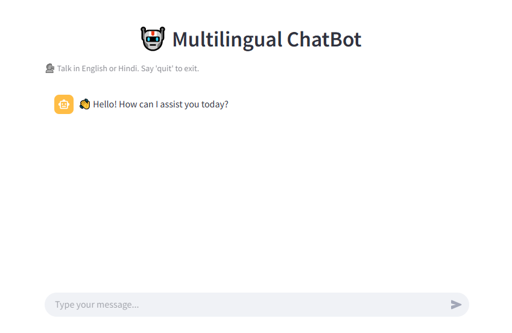

# 🤖 Multilingual AI ChatBot

A smart conversational AI bot built with **Google Gemini API** and **Streamlit**, supporting both **English** and **Hindi** languages. Designed to mimic a human-like assistant and structured for real-time interaction using a clean, responsive UI.

---

## 🧠 Features

- 💬 **Chat interface** with user and assistant views
- 🌐 **Multilingual** support (English and Hindi)
- ⚙️ Powered by **Google Gemini 1.5 Pro**
- 🧵 Maintains **conversation history** per session
- 🛑 Handles exit commands gracefully
- 🌈 Styled UI with emojis and chat bubbles
- 🔁 Built-in **rate limiter** to handle API limits

## 📸 Preview

 <!-- Replace with actual image path if available -->

